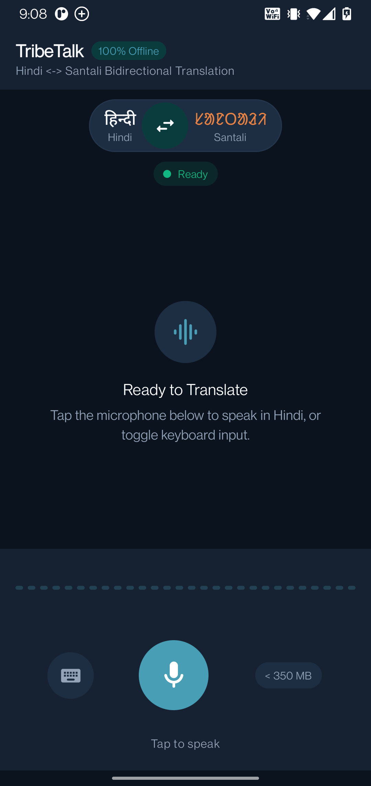

# TribeTalk (ट्राइबटॉक / ᱴᱨᱟᱭᱤᱵᱽᱴᱚᱠ)

**Offline-First Edge-AI Vernacular Pedagogy & Speech Translation Platform for Indigenous Primary Classrooms**  
Bridging **Hindi (हिन्दी - Devanagari)** and **Santali (ᱥᱟᱱᱛᱟᱲᱤ - Ol Chiki)** for Foundational Stage Education.

<p align="center">
  
</p>

| Attribute | Verified Repository Information |
| :--- | :--- |
| **Hackathon Initiative** | Smart India Hackathon (SIH) 2026 |
| **Problem Statement ID** | **SIH26042** |
| **Problem Statement Title** | **AI-Powered Vernacular Pedagogy and Real-Time Translation Tool for Mother Tongue-Based Primary Education** |
| **Organization** | **Government of Jharkhand** |
| **Theme** | **Smart Education** |
| **Category** | Software |
| **Repository Type** | SIH 2026 Submission Repository |
| **Active Branches** | `jk` (Latest Verified Submission) • `stable-talk` (Base Branch) |
| **Target Audience** | Primary School Teachers & Tribal Foundational Stage Learners (Ages 3–9) |
| **Build & Test Status** | 🟢 **Build Passing** (`assembleDebug`) • **78/78 Unit Tests Passing** (`testDebugUnitTest`) |

---

## 1. Smart India Hackathon 2026

- **Problem Statement ID**: `SIH26042`
- **Official Problem Statement Title**: *AI-Powered Vernacular Pedagogy and Real-Time Translation Tool for Mother Tongue-Based Primary Education*
- **Sponsoring Organization**: Government of Jharkhand
- **Theme**: Smart Education
- **Category**: Software
- **Target Deployment Context**: Government primary schools, Balvatikas, and Anganwadis across tribal districts of Jharkhand (Santhal Parganas, Kolhan, and Chota Nagpur divisions) and adjoining vernacular regions.

---

## 2. The Problem

1. **Classroom Language Divide**: In tribal primary schools across vernacular regions of Jharkhand, teachers are often Hindi speakers, while young children entering primary education primarily speak **Santali** (*Kherwal Bhasa*) at home.
2. **Foundational Learning Continuity (Ages 3–9)**: When early instruction occurs exclusively in an unfamiliar medium, foundational conceptual learning can stall. Both the National Education Policy (NEP) 2020 and the National Curriculum Framework for Foundational Stage (NCF-FS) 2022 recommend mother-tongue / home-language based education during early childhood to support cognitive development and reduce early learning disengagement.
3. **Low-Resource Language Constraints**: Santali is a scheduled Indian language written in its indigenous **Ol Chiki script (ᱚᱞ ᱪᱤᱠᱤ)**, created by Pandit Raghunath Murmu in 1925. However, it remains computationally low-resource, with limited availability of mobile-ready offline translation tools, speech models, and accessible digital learning assets.
4. **Intermittent / Limited Connectivity**: Many rural school environments experience intermittent electrical supply or lack dependable internet access, making cloud-dependent speech APIs impractical for consistent daily classroom use.
5. **Teacher Workload & Material Scarcity**: Teachers often lack the time or script-specific resources to manually create daily bilingual exercise sheets and visual aids aligned with official foundational learning objectives.

---

## 3. Our Solution

TribeTalk is an **offline-first mother-tongue classroom learning platform** designed for vernacular primary classrooms. It connects spoken classroom instruction directly with interactive digital learning and printable physical materials:

```
[ Hindi Speech / Input ]
           │
           ▼
[ Android Continuous Hindi ASR (SpeechRecognizer) ]
           │
           ▼
[ Hindi NLP Normalization & Token Deduplication ]
           │
           ▼
[ Ordered Live Utterance Queue (FIFO 1..N) ]
           │
           ▼
[ Production Translation Layer (Memory Cache + Curated Lexicon + Rules) ]
           │
           ▼
[ Santali Text (Ol Chiki ᱚᱞ ᱪᱤᱠᱤ + Phonetic Guide) ]
           │
           ▼
[ Ordered Santali Audio Playback (Feedback-Suppressed TTS) ]
           │
           ▼
[ Closed-Loop Pedagogy Subsystem ]
   ├── 1. Interactive Picture-First Flashcards (Study, Quiz, Match Modes)
   └── 2. Curriculum-Aligned Worksheet Studio (15 Activity Formats)
           │
           ▼
[ Offline Native A4 PDF Vector Export (Student Sheet + Teacher Answer Key) ]
```

TribeTalk captures classroom dialogue, translates it into authentic Santali Ol Chiki, reinforces vocabulary through interactive digital flashcards, and exports printable bilingual worksheets for student practice.

---

## 4. Core Features

### 4.1. Live Voice Translation (Continuous Classroom Loop)
- **Speech Capture**: Continuous speech recognition via Android `SpeechRecognizer` configured for Indian Hindi (`hi-IN`).
- **Hindi NLP Preprocessing**: `HindiNlpProcessor` eliminates token stuttering, normalizes Devanagari Danda (`।`) punctuation, and suppresses sub-word noise.
- **Ordered Utterance Flow**: `LiveUtteranceQueue` and `LiveUtteranceProcessor` enforce monotonically increasing sequence IDs (`1..N`) over a single-worker coroutine FIFO channel, ensuring Utterance 1 completes processing before Utterance 2 begins.
- **Bilingual Multi-Script Output**: Displays recognized Hindi alongside:
  - Authentic Santali in **Ol Chiki script (ᱚᱞ ᱪᱤᱠᱤ)**
  - Devanagari phonetic pronunciation guide (e.g. *पुथी झीज मे*)
  - Latin romanization (e.g. *Puthī jhije me*)
- **Acoustic Feedback Suppression**: Microphones are paused during Santali TTS speech output, preventing audio self-triggering loops.

### 4.2. Interactive FLN Flashcards Engine
- **Picture-First Card Architecture**: Every card displays visual cues first, followed by Hindi text, and an interactive tap-to-reveal mechanic for Santali Ol Chiki, pronunciation pills, and example sentences.
- **4-Tier Image Loader**: Fallback hierarchy:
  $$\text{Local File / Photo Picker URI} \longrightarrow \text{Bundled Vector Drawable} \longrightarrow \text{Unicode Emoji Pill} \longrightarrow \text{Category Thematic Icon}$$
- **Non-Overlapping Audio ("🔊 Hear Santali")**: Card-level audio pronunciation triggered via debounced callbacks to `TribeTalkTtsManager`.
- **Three Dedicated Learning Modes**:
  1. *Study Mode*: Picture-first card carousel with visual progress indicator, swipe/button navigation, and progressive Ol Chiki reveal.
  2. *Quiz Mode*: Dynamic multiple-choice questions derived from active deck data, immediate green/red feedback, running score tracker, and celebration summary.
  3. *Match Mode*: Dual-column 5-pair tactile association activity between Hindi and Santali, mismatch rejection, match locking, and victory banner.
- **Teacher Customization & Deck Builder**:
  - `+ Add Card` modal allowing teachers to input Hindi, draft translation, and enforce manual Santali overrides.
  - Custom Deck Builder filtering by Category, Grade, Skill, and Deck Size (5, 10, 15, 20 cards).
- **Offline Progress Tracking**: `SharedPreferences`-backed per-card performance statistics (`seenCount`, `revealedCount`, `heardCount`, `correctCount`, `incorrectCount`, `lastPracticedAt`).

### 4.3. Curriculum-Aligned Worksheet Studio
- **6 Foundational Stage Continuum**: Pre-School 1, Pre-School 2, Balvatika / Pre-School 3, Grade 1, Grade 2, and Grade 3.
- **Progressive Selection UI**: Stage $\rightarrow$ Domain $\rightarrow$ Competency $\rightarrow$ Activity Type $\rightarrow$ Question Count.
- **15 Pedagogical Activity Formats**:
  - `PICTURE_IDENTIFICATION` (चित्र पहचान)
  - `COUNT_AND_WRITE` (गिनो और लिखो)
  - `ORDERING` (क्रमबद्ध करो)
  - `CLASSIFICATION` (वर्गीकरण एवं छांटना)
  - `TRUE_FALSE` (सही या गलत)
  - `COMPLETE_PATTERN` (पैटर्न पूरा करो)
  - `TRACE_OR_WRITE` (अनुरेखण एवं सुलेख)
  - `SOLVE` (गणितीय हल करो)
  - `SHORT_ANSWER` (संक्षिप्त उत्तर)
  - `MATCHING` (जोड़ी मिलाओ)
  - `FILL_IN_THE_BLANK` (रिक्त स्थान)
  - `MULTIPLE_CHOICE` (बहुविकल्पी)
  - `WORD_MEANING` (शब्द अर्थ)
  - `READ_AND_ANSWER` (पढ़ो और उत्तर दो)
  - `SEQUENCING` (घटनाक्रम)
- **Pedagogical Suitability Guardrails**: Distinctly identifies non-worksheet competencies (gross motor, socio-emotional peer interaction, daily habits) as `ACTIVITY_BASED`, `TEACHER_LED`, or `OBSERVATION_BASED`, disabling paper question generation for activities meant for physical play.
- **In-Place Teacher Editing**: Allows teachers to edit Hindi question prompts, trigger dynamic on-device re-translation to Santali, and preserve changes under `TEACHER_VERIFIED` status.
- **Classroom Student Header**: Formatted for classroom distribution with Name, Class, Date, and Roll Number fields.
- **Multi-Page Native A4 PDF Vector Export**: Utilizes Android `android.graphics.pdf.PdfDocument` for vector rendering without external PDF libraries.
- **Separate Teacher Answer Key & Pedagogy Guide**: When enabled, generates a distinct evaluation page containing correct answers, competency codes, and verification statuses.
- **Flashcard-to-Worksheet Conversion**: 1-tap conversion transforming an active flashcard deck directly into a 5-activity bilingual worksheet.

---

## 5. Pedagogical Philosophy

```
Teacher Teaches
       │
       ▼
Live Language Bridge (Hindi ↔ Santali Voice)
       │
       ▼
Reusable Digital Content (Interactive Flashcards)
       │
       ▼
Active Learner Practice (Study, Quiz & Match)
       │
       ▼
Printable Physical Material (Bilingual A4 Worksheets)
```

- **Mother-Tongue Centric**: Directly supports tribal learners using authentic Ol Chiki script.
- **Low-Resource Language Focus**: Prioritizes Santali where commercial AI solutions are limited.
- **Offline-First Resilience**: Designed to operate without requiring continuous internet connectivity during daily classroom instruction.
- **Teacher Authority & Control**: Teachers can review, edit, and verify all translations before student exposure.

---

## 6. Target Users

| User Group | Context & Need | How TribeTalk Serves Them |
| :--- | :--- | :--- |
| **Primary School Teachers** | Non-Santali speaking educators posted in tribal areas of Jharkhand. | Translates daily lessons, instructions, and queries into Santali text and speech in real time. |
| **Tribal Primary Learners** | Children aged 3–9 entering Pre-School, Balvatika, Grade 1, 2, and 3. | Understand instructions in their mother tongue with visual and Ol Chiki reinforcement. |
| **School Administrators / Shiksha Mitras** | Resource-constrained rural schools with intermittent connectivity. | Generate printable A4 worksheets on device and print or share offline via Android Share Sheet. |

---

## 7. Curriculum Alignment

TribeTalk uses the official Government of India **NIPUN Bharat Guidelines** and the **National Curriculum Framework for Foundational Stage (NCF-FS) 2022** as its curriculum-alignment basis for worksheet and learning-content generation.

```
SIH26042 Problem Statement
            ↓
NIPUN Bharat & NCF-FS 2022 Framework
            ↓
Pancha Kosha & Positive Learning Habits
            ↓
13 Curricular Goals (CG-1 to CG-13)
            ↓
Competencies (C-1.1 to C-13.1)
            ↓
Cumulative Developmental Trajectories (Learning Outcomes)
            ↓
Bilingual Worksheet & Flashcard Activities
```

### Official Framework Coverage Summary
- **Pre-School 1 (Age 3–4)**: Sensory exploration, big/small object discrimination, counting up to 3, vertical line tracing.
- **Pre-School 2 (Age 4–5)**: Initial akshara sounds, counting up to 5, basic 2D shapes (circle, square), sorting domestic vs wild animals.
- **Pre-School 3 / Balvatika (Age 5–6)**: Sound-symbol correspondence, 2-letter sight words, counting up to 10, combining sets up to 5, repeating AB patterns, Sohrai mural tracing.
- **Grade 1 (Age 6–7)**: Simple 3-word sentences, labeling objects, numbers up to 20, single-digit addition/subtraction up to 9, community helpers.
- **Grade 2 (Age 7–8)**: Reading comprehension (45–60 WPM target), antonyms, 2-digit place value (tens and ones up to 99), 2-digit addition without regrouping, clean water hygiene.
- **Grade 3 (Age 8–9)**: Independent comprehension (>= 60 WPM target), sentence construction, 3-digit numbers up to 999, multiplication tables up to 10 and sharing division, visual fractions (1/2, 1/4), local ecology (Sal/Mahua trees).

> Detailed Audits and Traceability Matrices:
> - Source Extraction: [`docs/TRIBETALK_NIPUN_CURRICULUM_SOURCE_AUDIT.md`](docs/TRIBETALK_NIPUN_CURRICULUM_SOURCE_AUDIT.md)
> - Complete Traceability: [`docs/TRIBETALK_NIPUN_CURRICULUM_COVERAGE.md`](docs/TRIBETALK_NIPUN_CURRICULUM_COVERAGE.md)

---

## 8. 💾 Model & AI Runtime Portfolio

### 🟢 Production Runtime (Android On-Device)

| Pipeline Stage | Language / Domain | Technology / Engine | Runtime Layer | Architectural Role in Application |
| :--- | :--- | :--- | :--- | :--- |
| **Speech Recognition (ASR)** | Hindi (`hi-IN`) | Android `SpeechRecognizer` | Native Android SDK | Continuous classroom speech-to-text with auto-restart and error recovery. |
| **Speech Preprocessing** | Hindi | `HindiNlpProcessor` | Internal Kotlin Engine | Token deduplication, Danda (`।`) normalization, and sub-word noise filtering. |
| **Utterance Sequencing** | Hindi / Santali | `LiveUtteranceQueue` | Kotlin Coroutines / Channel | Monotonically ordered FIFO queue (`sequenceId: 1..N`) enforcing non-overlapping flow. |
| **Translation: Tier 1** | Hindi $\leftrightarrow$ Santali | `TranslationMemory` | In-Memory LRU Cache | High-speed exact-match retrieval for verified recurring classroom dialogues. |
| **Translation: Tier 2** | Hindi $\leftrightarrow$ Santali | `FlnCurriculumRepository` | In-Memory Lexicon | Curated bilingual foundational vocabulary across 5 pedagogical categories. |
| **Translation: Tier 3** | Hindi $\leftrightarrow$ Santali | `TribeTalkTranslator` | Internal Kotlin Engine | Deterministic morphological mapping and phonetic syllable extraction for Ol Chiki. |
| **Speech Synthesis (TTS)** | Santali (phonetic) | Android `TextToSpeech` | Native Android SDK | Audio playback via `TribeTalkTtsManager` with microphone feedback suppression. |
| **Curriculum Registry** | Bilingual | `NipunCurriculumRegistry` | Internal Kotlin Engine | 6 foundational stages (PS-1 to Grade 3), 13 curricular goals, 15 activity formats. |
| **Vector PDF Exporter** | Bilingual A4 | `android.graphics.pdf.PdfDocument` | Native Android Graphics | Vector A4 classroom worksheet and Teacher Answer Key export. |

### 🟡 Experimental / Research Models (Isolated Benchmarks)

| Model Artifact | Target Task | Staged Format | Runtime Environment | Status & Architectural Role |
| :--- | :--- | :--- | :--- | :--- |
| **IndicTrans2 320M Distilled** | Hindi $\leftrightarrow$ Santali Translation | ONNX INT8 (`442.8 MB` RAM) | Microsoft ONNX Runtime / Python | Isolated research benchmark for complex bilingual sentences. Excluded from live microphone loop to avoid high memory pressure on entry-level classroom hardware. |
| **IndicConformer CTC** | Hindi / Santali Speech Recognition | ONNX INT8 | ONNX Runtime / Python NeMo | Experimental acoustic model evaluated in Python desktop scripts (`tribetalk/asr/`) and staged in `OnnxConformerAsr.kt` (weights unbundled). |
| **Vernacular Piper / VITS** | Santali Audio Synthesis | ONNX / C++ Native | C++17 `tribetalk-native` | Offline acoustic synthesis engine implemented in `tribetalk-native/src/tts/` for desktop research evaluation. |
| **SmolLM2-135M / Qwen-0.5B** | FLN Curriculum Synthesis | ONNX INT4 | ONNX Runtime GenAI | Experimental on-device Small Language Model (SLM) scaffolding in `SlmCurriculumEngine.kt` for local activity generation. |

### 📊 Model & Memory Architecture Notes

- **Target Memory Constraint ($\le 950\text{ MB}$)**: Defined in native C++ (`tribetalk-native/include/tribetalk/resource/resource_manager.h`) and Python (`tribetalk/resource_manager.py`) resource managers as an engineering target for low-end devices (allocating $\le 950\text{ MB}$ for ML tasks on devices with 3–4 GB total system RAM). It is an engineering target, not an Android production single-model measurement.
- **Measured On-Device Footprint**: Profiled on physical test hardware (realme P1 5G, 8 GB RAM, Android 14):
  - Live Translation Engine: $\sim 80\text{--}85\text{ MB}$ RAM footprint.
  - Full Interactive Application (UI + Jetpack Compose): $\sim 165\text{ MB}$ peak RAM.
  - IndicTrans2 Research Benchmark (isolated): $442.8\text{ MB}$ peak RAM with $636.86\text{ ms}$ inference latency.

---

## 9. Complete Verified Tech Stack

The technology stack below is derived directly from the active codebase, build configuration files (`build.gradle.kts`, `app/build.gradle.kts`, `gradle/libs.versions.toml`), and Kotlin source implementations:

| Layer | Verified Technology | Version | Purpose in TribeTalk |
| :--- | :--- | :--- | :--- |
| **Operating System** | Android | API 26+ (Android 8.0 to Android 14+) | Target operating platform (`minSdk = 26`, `targetSdk = 34`, `compileSdk = 34`). |
| **Language** | Kotlin | `2.0.21` | Primary language for application logic, state management, and UI. |
| **Build System** | Gradle (Kotlin DSL) | `8.5.2` (AGP `8.5.2`) | Build orchestration, dependencies, and native toolchain configuration. |
| **UI Framework** | Jetpack Compose | BOM `2024.10.00` | Declarative UI toolkit across all screens, dialogs, and components. |
| **Design System** | Material Design 3 | `androidx.compose.material3` | Thematic tokens, color palettes, responsive cards, and dynamic navigation. |
| **Iconography** | Material Icons Extended | `1.7.4` | Classroom, navigation, and pedagogical vector iconography. |
| **Architecture** | MVVM + Repository Pattern | Jetpack Lifecycle `2.8.6` | Unidirectional data flow, `ViewModel`, and `StateFlow` reactive state streams. |
| **Concurrency** | Kotlin Coroutines & Channels | `1.8.1` | Asynchronous background pipelines, FIFO utterance queue, and debounced IO. |
| **Speech Recognition** | Android `SpeechRecognizer` | Native Android SDK | Continuous speech-to-text with `EXTRA_LANGUAGE = "hi-IN"`. |
| **NLP Preprocessing** | `HindiNlpProcessor` | Internal Kotlin Engine | Token deduplication, Danda punctuation normalization, and sub-word noise filtering. |
| **Live Queue** | `LiveUtteranceQueue` | Internal Coroutine Channel | Monotonically ordered FIFO queue (`sequenceId: 1..N`) for speech interpretation. |
| **Translation: L1** | `TranslationMemory` | Internal LRU Cache | In-memory exact match lookup for verified classroom phrases. |
| **Translation: L2** | `FlnCurriculumRepository` | Internal Lexicon | Curated bilingual FLN foundational vocabulary. |
| **Translation: L3** | `TribeTalkTranslator` | Internal Engine | Rule-based grammatical and morphological fallback translation. |
| **Curriculum Registry** | `NipunCurriculumRegistry` | Internal Engine | Central registry for 6 foundational levels and 15 activity types. |
| **Speech Synthesis** | Android `TextToSpeech` | Native Android SDK | Text-to-speech engine managed by `TribeTalkTtsManager` with acoustic feedback suppression. |
| **Image Resolution** | `FlashcardImageLoader` | Internal Engine | 4-tier visual fallback: local URI $\rightarrow$ vector drawable $\rightarrow$ emoji $\rightarrow$ category icon. |
| **PDF Generation** | `android.graphics.pdf.PdfDocument` | Native Android Graphics | Vector A4 PDF rendering with student header, page breaks, and Teacher Answer Key. |
| **Local Persistence** | Android `SharedPreferences` | Native Android SDK | Offline storage for card progress (`FlnProgressManager`) and teacher preferences. |
| **Native Toolchain** | CMake & NDK | CMake `3.22.1`, NDK `28.2` | C++17 native compilation (`-std=c++17 -O3`) for `arm64-v8a` and `x86_64`. |
| **Unit Testing** | JUnit 4 | `4.13.2` | Automated test suites for curriculum validation, flashcards, and worksheets. |
| **Experimental ML** | Microsoft ONNX Runtime | `1.18.0` (`onnxruntime-android`) | Isolated benchmark runtime for IndicTrans2 320M model (excluded from live loop). |

---

## 10. System Architecture

```mermaid
flowchart TD
    subgraph LiveVoicePipeline["Live Classroom Voice Translation Pipeline (Production)"]
        Mic["Teacher Microphone (Hindi Speech)"] --> ASR["Android SpeechRecognizer (hi-IN)"]
        ASR --> NLP["Hindi NLP Processor\n• Token Deduplication\n• Danda Normalization"]
        NLP --> Queue["Live Utterance Queue\n• Sequential FIFO IDs (1..N)\n• Coroutine Channel"]
        Queue --> TransEngine{"3-Tier Translation Engine"}
        
        TransEngine -->|L1 Cache| L1["Translation Memory Cache\n• Exact Match"]
        TransEngine -->|L2 Lexicon| L2["Curated FLN Lexicon\n• Foundational Vocabulary"]
        TransEngine -->|L3 Fallback| L3["Rule & Morphological Engine\n• Syllable & Grammar Mapping"]
        
        L1 --> OutText["Bilingual Text Display\n• Hindi Devanagari\n• Santali Ol Chiki\n• Latin & Phonetic Guide"]
        L2 --> OutText
        L3 --> OutText
        
        OutText --> TTSQueue["Santali Audio Queue & TTS\n• Ordered Non-Overlapping Playback\n• ASR Feedback Suppression"]
        TTSQueue --> Speaker["Speaker Output (Santali Audio)"]
    end

    subgraph PedagogyPipeline["Closed-Loop Pedagogy Subsystem (Offline-First)"]
        CurriculumRegistry["NipunCurriculumRegistry\n• 6 Stages (PS-1 to G-3)\n• 13 Curricular Goals (CG-1 to CG-13)\n• 15 Activity Types\n• Verification Tracking"]
        
        CurriculumRegistry --> Flashcards["Interactive Flashcards Engine\n• Picture-First Architecture\n• 4-Tier Image Loader\n• Study, Quiz, & Match Modes\n• Offline Progress Tracker"]
        
        Flashcards -->|Create Worksheet from Deck| Worksheets["Worksheet Studio\n• Progressive Filtering UI\n• Student Classroom Header\n• Teacher In-Place Editing\n• Santali Verification Badges"]
        
        CurriculumRegistry -->|Generate from Curriculum| Worksheets
        
        Worksheets --> PDFExporter["WorksheetPdfExporter (android.graphics.pdf)\n• Native A4 Vector Pages\n• Page-Break Flow\n• Dotted Student Answer Space\n• Separate Teacher Answer Key Page"]
        
        PDFExporter --> PhysicalSheet["Printable Classroom Materials (A4 PDF)"]
    end

    subgraph ExperimentalResearch["Experimental Research Benchmark (Isolated)"]
        IndicTrans["IndicTrans2 320M ONNX Model\n(442.8 MB RAM, 636.86 ms inference)\n*Isolated in offline benchmark scripts*"]
    end
```



---

## 11. Offline-First Design

TribeTalk is architected to ensure that limited internet access does not degrade core classroom learning:

| Capability | On-Device / Offline Status | Technical Mechanism |
| :--- | :---: | :--- |
| **Curriculum Registry** | **Offline-First (On-Device)** | Bundled in compiled application binary (`NipunCurriculumRegistry.kt`). |
| **Translation Memory** | **Offline-First (On-Device)** | Local in-memory dictionary of verified classroom expressions. |
| **FLN Lexicon** | **Offline-First (On-Device)** | Preloaded vocabulary spanning foundational categories. |
| **Interactive Flashcards** | **Offline-First (On-Device)** | Uses bundled vector drawables, emojis, and local photos with zero remote API calls. |
| **Card Progress Tracking** | **Offline-First (On-Device)** | Saved in private local Android `SharedPreferences`. |
| **Worksheet Generation** | **Offline-First (On-Device)** | Deterministic Kotlin activity synthesis. |
| **PDF Vector Export** | **Offline-First (On-Device)** | Generated directly in Android app cache storage via `PdfDocument`. |
| **Hindi Speech Input** | **Local System Service** | Utilizes on-device Android `SpeechRecognizer` (supports offline speech packs when installed). |
| **Santali Audio Speech** | **Local System Service** | Utilizes on-device Android `TextToSpeech` engine. |

*Note: Android system services (`SpeechRecognizer` and `TextToSpeech`) operate offline when respective on-device language packs are installed on the device OS.*

---

## 12. Translation / Language Quality & Verification

TribeTalk prioritizes linguistic authenticity over raw unverified quantity:

### Script Authenticity
All Santali output is provided in authentic **Ol Chiki script (ᱚᱞ ᱪᱤᱠᱤ)**. The application strictly avoids phonetic transliteration of Hindi words into Ol Chiki characters, presenting genuine Santali vocabulary (e.g. `ᱜᱟᱹᱭ` for Cow, `ᱯᱩᱛᱷᱤ` for Book, `ᱫᱟᱜ` for Water, `ᱥᱤᱸᱜᱤ` for Sun, `ᱥᱟᱨᱡᱚᱢ` for Sal tree).

### 4-Tier Verification State Tracking
Every bilingual item in the registry and generated worksheets maintains an explicit verification state:
1. `VERIFIED`: Audited against official primary literature, NCERT Vidya Pravesh, and validated tribal school primers.
2. `TEACHER_VERIFIED`: Dynamically assigned when a classroom teacher edits or confirms content on device.
3. `NEEDS_REVIEW`: Flagged in the UI with an amber badge for teacher inspection prior to printing.
4. `UNAVAILABLE`: Renders fallback prompt: `Santali: Teacher verification required`, allowing teachers to manually input the local dialect word.

---

## 13. Performance Profile

Performance profiling conducted on physical development hardware:
- **Device Profiled**: realme P1 5G (`RMX3870`)
- **Processor**: MediaTek Dimensity 7050 (Octa-Core ARM64)
- **RAM**: 8 GB
- **Operating System**: Android 14 (API 34)

| Pipeline Component | Measured Execution / Latency | Peak Memory (RAM) | Notes |
| :--- | :--- | :--- | :--- |
| **Live Translation Pipeline** | $\sim 5\text{--}25\text{ ms}$ (in-memory retrieval) | $\sim 80\text{--}85\text{ MB}$ | Lightweight live translation loop. |
| **Flashcard Interactions** | $< 16\text{ ms}$ (60 fps rendering) | $\sim 90\text{--}110\text{ MB}$ | Multi-tier image loading. |
| **Worksheet PDF Generation** | $\sim 120\text{--}250\text{ ms}$ (2-page A4) | $\sim 95\text{ MB}$ | Native vector rendering via `PdfDocument`. |
| **IndicTrans2 (Experimental)** | $636.86\text{ ms}$ inference | $442.8\text{ MB}$ | Isolated research benchmark; excluded from live speech loop. |

*Detailed hardware profiling benchmarks are documented in [`docs/TRIBETALK_FINAL_INTEGRATION_QA.md`](docs/TRIBETALK_FINAL_INTEGRATION_QA.md).*

---

## 14. Classroom Demo Flow

For evaluators and judges, the end-to-end classroom workflow can be experienced in 10 steps:

```
Step 1: Open TribeTalk App
   ↓
Step 2: Tap "Live Translation" and Speak in Hindi
   ↓
Step 3: Observe Instant Hindi Text Display
   ↓
Step 4: View Real-Time Santali Translation in Ol Chiki (ᱚᱞ ᱪᱤᱠᱤ)
   ↓
Step 5: Hear Ordered Santali TTS Audio Playback
   ↓
Step 6: Navigate to "Flashcards" & Select a Thematic Deck (e.g., Animals)
   ↓
Step 7: Engage Learners in Study, Quiz, and Match Modes
   ↓
Step 8: Open "Worksheets" -> Select Stage (e.g., Grade 2) & Target Competency
   ↓
Step 9: Preview Worksheet, Inspect Verification Badges & Make Teacher Edits
   ↓
Step 10: Export Printable 2-Page A4 PDF (Student Sheet + Teacher Answer Key)
```

---

## 15. Repository Structure

```
TribeTalk/
├── app/                                     # Android Application Module (Kotlin + Jetpack Compose)
│   ├── src/
│   │   ├── main/
│   │   │   ├── java/org/tribetalk/
│   │   │   │   ├── audio/                   # ASR & TTS Managers (TribeTalkTtsManager, AndroidSpeechRecognizer)
│   │   │   │   ├── core/                    # Translation Facade & Native Bridge (TribeTalkTranslator, NativePipeline)
│   │   │   │   ├── flashcards/              # Flashcards Engine (ImageLoader, LearningFramework)
│   │   │   │   ├── fln/                     # FLN Curricula, Repositories, Progress Tracking
│   │   │   │   ├── nlp/                     # HindiNlpProcessor & LiveUtteranceQueue
│   │   │   │   ├── ui/                      # Jetpack Compose UI (Screens, Components, Theme)
│   │   │   │   ├── voice/                   # LiveVoiceInputManager
│   │   │   │   └── worksheet/               # Worksheet Studio & NipunCurriculumRegistry
│   │   │   ├── res/                         # Vector drawables, values, localized strings
│   │   │   └── AndroidManifest.xml          # Application manifest & permissions
│   │   └── test/java/org/tribetalk/         # Automated Unit Tests (78 tests passing)
│   └── build.gradle.kts                     # Module build configuration (SDK 34, Compose, CMake)
├── docs/                                    # Forensic Verification & Audit Reports
│   ├── TRIBETALK_FINAL_INTEGRATION_QA.md    # Integration QA & hardware profiling report
│   ├── TRIBETALK_FLASHCARD_ENHANCEMENT_QA.md# Flashcard studio verification report
│   ├── TRIBETALK_NIPUN_CURRICULUM_COVERAGE.md# 6-stage curriculum traceability matrix
│   ├── TRIBETALK_NIPUN_CURRICULUM_SOURCE_AUDIT.md # NCF-FS & NIPUN source audit
│   └── TRIBETALK_WORKSHEET_ENHANCEMENT_QA.md# Worksheet QA & test checklist
├── gradle/                                  # Gradle wrapper and version catalogs
├── models/                                  # Model staging directories (.gitkeep)
├── scripts/                                 # Model conversion and migration scripts
├── tests/                                   # Python pipeline & model unit tests
├── training/                                # Research training scripts & adaptation benchmarks
├── tribetalk/                               # Python reference pipeline & resource manager
├── tribetalk-native/                        # C++17 Native Layer (CMakeLists.txt, JNI bridge)
├── build.gradle.kts                         # Root project build configuration
├── gradle.properties                        # JVM & Gradle build parameters
├── gradlew / gradlew.bat                    # Gradle wrapper scripts
├── requirements.txt                         # Python dependencies for research tools
├── settings.gradle.kts                      # Gradle settings & module inclusion
└── tribetalk_screen.png                     # Application screenshot
```

---

## 16. Documentation Index

The following detailed forensic audits and engineering reports are available in the repository:

1. **Curriculum Source Audit**:  
   [`docs/TRIBETALK_NIPUN_CURRICULUM_SOURCE_AUDIT.md`](docs/TRIBETALK_NIPUN_CURRICULUM_SOURCE_AUDIT.md)  
   *Authoritative breakdown of NCF-FS 2022, NIPUN Bharat, and NCERT Vidya Pravesh goals and developmental continuums.*

2. **Curriculum Coverage Matrix**:  
   [`docs/TRIBETALK_NIPUN_CURRICULUM_COVERAGE.md`](docs/TRIBETALK_NIPUN_CURRICULUM_COVERAGE.md)  
   *Full 6-stage traceability table (PS-1 through Grade 3) mapping domains, CGs, and competencies to worksheet activities.*

3. **Worksheet Subsystem QA**:  
   [`docs/TRIBETALK_WORKSHEET_ENHANCEMENT_QA.md`](docs/TRIBETALK_WORKSHEET_ENHANCEMENT_QA.md)  
   *Detailed QA report on worksheet generation, answer keys, verification badges, and physical device test checklist.*

4. **Flashcard Learning Experience QA**:  
   [`docs/TRIBETALK_FLASHCARD_ENHANCEMENT_QA.md`](docs/TRIBETALK_FLASHCARD_ENHANCEMENT_QA.md)  
   *Comprehensive verification report for Study, Quiz, and Match modes, image loader tiers, and progress persistence.*

5. **Integration & Live Voice Audio QA**:  
   [`docs/TRIBETALK_FINAL_INTEGRATION_QA.md`](docs/TRIBETALK_FINAL_INTEGRATION_QA.md)  
   *Hardware profiling report on realme P1 5G, sequential utterance ordering, and acoustic feedback suppression.*

---

## 17. Setup & Build Instructions

### Prerequisites
- **JDK**: OpenJDK 17 or Oracle JDK 17
- **Android SDK**: Android SDK Platform 34 (API Level 34)
- **Android NDK**: NDK Version `28.2.13676358`
- **CMake**: Version `3.22.1`
- **Android Studio**: Android Studio Ladybug (2024.2+) or Jellyfish (2024.1+)

### Build Commands

1. **Clone the Repository**:
   ```bash
   git clone https://github.com/jeshu05/TribeTalk.git
   cd TribeTalk
   git checkout jk
   ```

2. **Build Debug APK**:
   - On Linux / macOS:
     ```bash
     ./gradlew assembleDebug
     ```
   - On Windows (PowerShell / Command Prompt):
     ```powershell
     .\gradlew.bat assembleDebug
     ```
   *The compiled APK will be generated at:*  
   `app/build/outputs/apk/debug/app-debug.apk`

3. **Run Automated Unit Tests**:
   - On Linux / macOS:
     ```bash
     ./gradlew testDebugUnitTest
     ```
   - On Windows:
     ```powershell
     .\gradlew.bat testDebugUnitTest
     ```

---

## 18. Testing & Verification

TribeTalk adheres to strict automated validation:

- **Automated Unit Testing**: **78 unit tests pass (100%)** via `./gradlew.bat testDebugUnitTest`.
  - `NipunCurriculumTest`: Registry integrity, stage representation, non-duplicate IDs, curriculum filtering, worksheet generation, and bilingual verification.
  - `WorksheetGeneratorTest`: Deterministic generation, bilingual integrity, retranslation across all 15 question types, and teacher edit preservation.
  - `FlashcardFlnExperienceTest`: Model creation, preset deck integrity, scoring logic, matching game verification, and manual override preservation.
  - `HindiNlpProcessorTest`: Noise suppression, token deduplication, and Danda punctuation normalization.
- **Compilation Validation**: Clean compilation with zero build errors across all Gradle tasks (`assembleDebug`).
- **Physical Device QA**: Evaluators can verify features directly on real hardware using the manual test checklists in [`docs/TRIBETALK_WORKSHEET_ENHANCEMENT_QA.md`](docs/TRIBETALK_WORKSHEET_ENHANCEMENT_QA.md).

---

## 19. Limitations

1. **Corpus Size for Low-Resource Languages**: While foundational primary school vocabulary is curated and verified, the corpus of complex literary or administrative Santali vocabulary remains small.
2. **Teacher Verification Required for Uncurated Words**: Colloquial or out-of-vocabulary Hindi words fallback to rule-based approximation and are explicitly marked as `NEEDS_REVIEW` or `UNAVAILABLE` pending teacher confirmation.
3. **Regional Dialectal Variations**: Santali pronunciation and vocabulary exhibit minor regional dialectal nuances across Jharkhand (Santhal Parganas), West Bengal, and Odisha.
4. **Isolated Benchmark Models**: High-parameter neural models (e.g. IndicTrans2 320M) require substantial RAM ($\sim 442\text{ MB}$) and are excluded from the live pipeline to maintain real-time responsiveness on lower-end devices.

---

## 20. Future Scope

1. **Corpus Expansion**: Partner with local tribal language academies and Santhali literary organizations to expand verified vocabulary beyond the Foundational Stage into Preparatory and Middle school grades.
2. **Multi-Tribal Vernacular Expansion**: Extend the underlying architecture to support other indigenous tribal languages of Jharkhand, including **Ho (Warang Chiti)** and **Mundari**.
3. **On-Device Acoustic Model Tuning**: Fine-tune localized lightweight acoustic models specifically trained on tribal accents and child speech.
4. **Community Collaborative Authoring**: Enable teachers to export, import, and share verified lesson card decks and exercise templates peer-to-peer via local Wi-Fi Direct or Bluetooth.

---

## 21. SIH Value Proposition

TribeTalk provides an immediately deployable, pedagogically grounded solution for **SIH26042**:
- **Bridges the Classroom Language Divide**: Supports communication between Hindi-speaking teachers and Santali-speaking children from day one.
- **Pedagogically Aligned**: Directly implements the Government of India's **NIPUN Bharat** and **NCF-FS 2022** foundational stage standards.
- **Works Where It Matters**: Operates offline-first in remote primary schools without requiring continuous internet connectivity or expensive cloud infrastructure.
- **Celebrates Indigenous Culture**: Honors and reinforces the authentic **Ol Chiki script**, supporting the linguistic identity of tribal learners.

---

## 22. Team & Project Credits

- **Project**: TribeTalk (ट्राइबटॉक / ᱴᱨᱟᱭᱤᱵᱽᱴᱚᱠ)
- **Initiative**: Smart India Hackathon 2026
- **Lead Contributors & Maintainers**:
  - **JaiAakash21**
  - **jeshu05**

---

## 23. License

License not currently specified.

---

## 24. Truthful Claim Audit

In adherence to forensic verification standards, README claims are based on the current repository and linked verification documents:

| Audited Dimension | Technical Status |
| :--- | :--- |
| **Translation Accuracy** | Curated vocabulary is verified against official primary primers; fallback terms are explicitly flagged as `NEEDS_REVIEW` or `UNAVAILABLE`. No universal 100% accuracy is claimed. |
| **Curriculum Scope** | Implements the official NCF-FS Foundational Stage continuum across 6 levels (PS-1 through Grade 3). It does not claim to cover upper primary or secondary syllabi. |
| **Offline-First Execution** | Core application modules (Curriculum Registry, Translation Memory, Flashcards, Worksheets, PDF export) execute offline. Speech recognition and TTS utilize on-device Android system services. |
| **AI Model Architecture** | The production pipeline utilizes a lightweight 3-tier hybrid engine. IndicTrans2 and IndicConformer are accurately documented as isolated research/benchmark prototypes. |
| **Hardware Compatibility** | Profiled on realme P1 5G (8 GB RAM). No generalized claims of identical performance across all arbitrary low-end hardware are made. |
